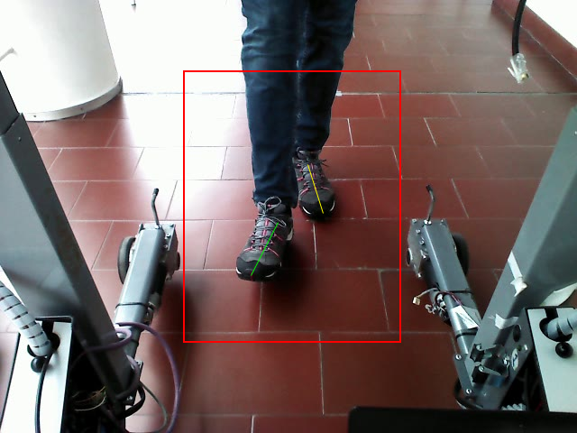

# FeetDetection
Feet Detection using Matlab (Computer Vision assignment)

The goal of this assigment is detecting the heel and toe of a person based on a video

# Final Result

# Authors
* [Jose Filipe Ferreira](https://github.com/JoseFilipeFerreira)
* [Luis Ferreira](https://github.com/LPFerreira33)

## License
This project is licensed under the MIT License - see the [LICENSE](LICENSE) file for details
